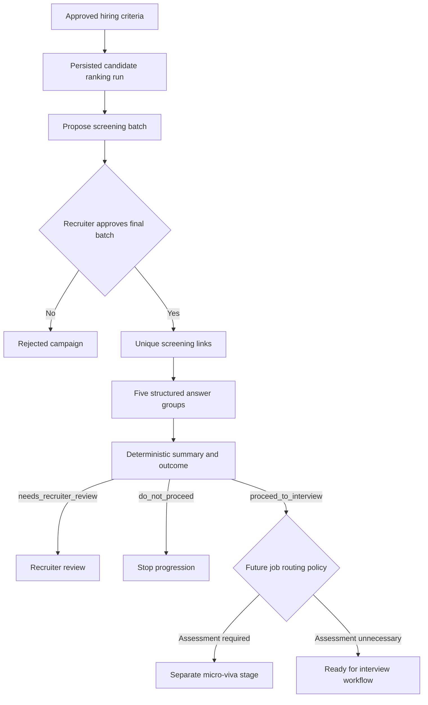

# FitCheck: candidate screening implementation plan

Status: planning only. This pass creates the plan; service code and migrations come later.

## 1. Recommended scope and architecture

Build screening as a standalone Python service directory, `candidate-screening/`, using FastAPI, Pydantic v2, psycopg, and pytest. Keep its domain logic deterministic. Build micro-viva later as a separate stage with its own API, persistence, model adapters, evaluation, and operating limits. Define the interface between them now.

Separate stages do not require separate infrastructure on day one. They can share a repository, Postgres instance, and deployment environment while owning different tables and dependencies. Screening must start and pass its tests without loading ranking models or a viva model client.



`proceed_to_interview` remains the required screening outcome string. It means basic screening passed, not technical capability established or an interview scheduled. The diagram shows stage boundaries; the future routing policy is executed by the external orchestrator, which persists its HITL pause and recruiter approval before invoking the next tool. This approval is not an additional stage inside the screening service. A full recruiter interview is not a prerequisite for viva.

The next implementation covers initial screening through completed summaries and the recruiter review endpoint. Micro-viva will be a separate pipeline in its own directory with its own API. Progression approval belongs to the future orchestrator; viva validates that authorization before starting. Their handoff contract is documented here so a screening pass is never treated as automatic authorization to start viva. No service implementation is authorized in this planning pass.

## 2. What the existing repository establishes

The workspace itself is the `talent-ranker` project (`pyproject.toml`); its package is `src/talent_ranker/`. No separate sibling directory named `talent-ranker` was found under `C:/project`.

| Existing component | Implication for screening |
| --- | --- |
| `repository.py`: parameterized raw SQL and explicit psycopg transactions | Follow the same repository style; no ORM. |
| `api.py`, `pipeline.py`, `schemas.py` | Keep thin endpoints, an injected pipeline/service class, and typed contracts. |
| `candidates.candidate_id` is text; candidates have `deleted_at` | Preserve identifiers; exclude deleted candidates at selection, approval, delivery, and candidate access. |
| `ranking_results` is keyed by `(run_id, candidate_id)` | Resolve one run per proposal; never combine scores from different runs. |
| `ranking_runs` stores `job_id` and `job_profile_version_id` | Pin both run and criteria version in the campaign. |
| Ranking scores currently use a 0–1 scale | Validate finite thresholds on that scale for this integration. |
| Ranking persists only the requested shortlist | Selection operates on saved results, not every candidate in the database. |
| `job_profile_versions.priorities` stores approved must-haves and fit constraints | Derive screening configuration from an explicitly selected approved version, then freeze it for the campaign. |
| Resume text is redacted; no dedicated email column exists | Contact lookup is a separate integration contract; do not extract email from resume text. |

Use a connection pool with one borrowed connection per operation/transaction. Do not copy the existing singleton connection into a concurrent screening API: cursors on a shared connection share transaction state. See [psycopg concurrency guidance](https://www.psycopg.org/psycopg3/docs/advanced/async.html).

## 3. Design decisions after clarification

The user delegated the question design, email architecture, and mismatch policy decisions. The following are the selected engineering defaults. Deployment credentials, the actual upstream contact feed, and the production identity provider are environment inputs to supply later; they do not block local implementation.

| Decision | Selected starting point |
| --- | --- |
| Exact question shape | Five fixed answer groups; qualifications contains one confirmation per approved must-have, identified by stable requirement IDs. |
| Email sender and contact source | `EmailSender` protocol, fake sender for tests, configurable SMTP adapter for initial delivery. A `ContactResolver` reads a dedicated `screening_contacts` table keyed by existing candidate ID, populated explicitly from recruiter/ATS contact records. Never guess a `metadata.email` contract. |
| Mismatch policy | Missing, uncertain, conflicting, or non-comparable answers require recruiter review. Automatic rejection requires an explicit, approved hard-fail policy, apart from a completed response stating no interest. |
| Pre-send representation | Keep the six requested lifecycle values; use internal `status = NULL` before provider acceptance, with delivery state stored separately and exposed in recruiter responses. Explicitly document this nullable preparation state and enforce timestamp constraints. Never report an unsent invite as `sent`. |
| Expiry start | Default 48 hours from approval/token creation, configurable and frozen per campaign. Delayed delivery does not reset the deadline; stale queued messages are suppressed. |
| Approval edits | Recruiter may add/remove candidates from the pinned run, including candidates outside the original threshold. Preserve both proposed and final lists. |
| Repeat campaigns | Idempotency prevents duplicates within a campaign. Do not silently suppress candidates across distinct approved campaigns; a new campaign represents a new explicit batch decision. |
| Authentication integration | Protected recruiter/service endpoints and an injected principal dependency; only a recruiter-authorized principal can approve/reject. A local test identity is development-only. Select production identity integration before deployment. |

The five groups remain configurable per job through wording, enabled/required flags, requirement IDs, validation bounds, and fit rules. This pass does not build a generic questionnaire designer or permit arbitrary executable rules.

**Why these choices:** individual must-have confirmations show exactly what is uncertain; a single yes/no qualifications question cannot do that. Keep the form short by using the recruiter's actual must-haves, not every keyword or preferred skill. Availability and notice period answer different questions, so collect both and flag contradictions. Ask for compensation expectations, not prior salary, and preserve currency/pay period explicitly.

Use hard-fail rules only when the recruiter deliberately configures them. Employer-configured question/answer rejection rules exist in products such as [Greenhouse](https://support.greenhouse.io/hc/en-us/articles/360000653472-Auto-reject); that supports the configuration pattern, not a universal standard mandating automatic rejection. Our conservative review default is an engineering/product choice for incomplete self-reported evidence.

SMTP is a portable first adapter, not a commitment to operating a mail server. For example, [SES supports both SMTP and API sending](https://docs.aws.amazon.com/ses/latest/dg/send-email.html). Host, credentials, sender identity, TLS, timeouts, and concurrency limits belong in settings. An SES/SendGrid HTTP adapter can replace SMTP when provider-specific delivery receipts or controls are needed. Worker rate limits and retry/backoff obey the configured provider quota. `sent` means provider accepted the message, not proof of inbox delivery.

`screening_contacts` stores email, provenance (`source`, optional external reference), update time/actor, and an explicit contactability flag. It does not imply mailbox ownership was verified. A small protected contact-configuration endpoint can set these details for an existing candidate; it never creates candidates, parses resumes, or performs ranking ingestion. A later ATS-backed resolver can replace this local store without changing campaigns. Fixture contacts and the fake sender make the first implementation runnable immediately.

## 4. Minimal directory and object design

```text
candidate-screening/
  pyproject.toml
  README.md
  .env.example
  db/schema.sql
  src/candidate_screening/
    __init__.py
    api.py             # App factory, dependencies, typed HTTP boundaries
    config.py          # Settings, limits, link base URL, expiry
    schemas.py         # Pydantic requests, responses, enums, job configuration
    pipeline.py        # ScreeningPipeline use cases and transaction coordination
    repository.py      # Repository protocol and psycopg implementation
    selection.py       # Selection contract and validation
    lifecycle.py       # Pure transition rules
    summary.py         # Pure answer evaluation and summary generation
    email.py           # Sender/contact protocols, SMTP adapter, local fakes
    delivery.py        # Durable initial-email delivery and retry handling
    cli.py             # Dispatch and expiry sweep entry points
  tests/
    unit/
    api/
    integration/
```

Use composition: `ScreeningPipeline` receives a repository and clock; the dispatcher receives a repository, sender, contact resolver, and clock. Token creation is injected where needed for tests. Pure functions handle transitions and classification. Use small protocols for replaceable I/O boundaries, not inheritance hierarchies or a generic workflow framework.

Keep implementation and test code files at or below roughly 250 lines by default. Split growing files by cohesive responsibility (for example, campaign/invite routes, schemas, or repositories), preserving small public interfaces. Exceed the limit only when necessary for clarity and document the reason. Do not compress statements or remove useful readability to satisfy the count. Planning documents are exempt; the directory sketch can expand into focused modules as implementation grows.

The package has its own dependencies and startup command. It reads existing upstream tables through repository methods and writes only screening-owned tables. A fresh standalone integration test database supplies minimal upstream fixtures; this service does not recreate or ingest the production candidate corpus.

## 5. Data model and transaction boundaries

`candidate-screening/db/schema.sql` creates the new tables and required indexes against the documented upstream schema. Keep existing ranking migrations untouched. Use UUIDs for screening records, text for candidate/job IDs, `timestamptz` for timestamps, and SQL CHECK/UNIQUE/FK constraints alongside Pydantic validation.

| Table | Required data and additions |
| --- | --- |
| `screening_contacts` | One contact per existing candidate: FK candidate ID, validated email, source/external reference, contactability flag, updated time/actor. Screening-owned contact configuration, separate from resume/ranking data. |
| `screening_job_configs` | Immutable versioned configuration per job: profile version, question definitions, required flags, explicit mismatch/hard-fail rules, policy version, creator and creation time. |
| `screening_campaigns` | Requested `id`, `job_id`, `selection_rule` JSONB, `proposed_candidate_ids` text array, `message_template`, status (`proposed/approved/rejected`), approver/times; add pinned run/profile/config IDs, immutable config snapshot, `final_candidate_ids`, revision, expiry duration, and request idempotency metadata. |
| `screening_invites` | Requested `id`, `campaign_id`, `candidate_id`, unique indexed `token`, six lifecycle values and timestamps; add `declined_at`, `expired_at`, and UNIQUE `(campaign_id, candidate_id)`. Status is null only before sending/expiry, as described above. |
| `screening_responses` | One row per invite: typed answer columns, structured requirement confirmations, response revision, saved/submitted times. Drafts can be replaced before completion. |
| `screening_summary` | One immutable row per completed invite: confirmed assertions, missing fields, verification items, reason codes, exactly one required outcome, config/policy versions, generation time. |
| `screening_delivery_outbox` | One initial-link message per invite: recipient snapshot, frozen rendered template, delivery status (`pending/processing/sent/failed/cancelled`), attempts, next attempt, lease, sanitized error, provider receipt. |

Arrays preserve the requested campaign contract; individual IDs are checked in the approval transaction and final membership is materialized as FK-constrained invites. PostgreSQL cannot apply an element-wise foreign key to the arrays.

Indexes: campaign `(job_id, created_at, id)`, invite `(campaign_id, status, id)`, unique token, partial expiry index for active invites, outbox due/lease indexes, summary outcome/invite index. Assess selection query plans on representative saved runs; propose any additional upstream index separately.

**Proposal:** resolve and pin one run, validate configuration, save the full proposed list and audit context. No token generation or sending.

**Approval:** lock the campaign row; verify proposed status and expected revision; validate final candidate membership, contact resolution, and current candidate eligibility; freeze config/template/list; create unique tokens, invites, and outbox entries; record approval; commit together. Do contact preflight before taking the lock, then recheck database facts inside it. Missing contacts return a structured blocker list so the recruiter can fix or remove candidates; do not silently drop anyone.

Identical repeated approval returns the stored result; a different candidate list or template after approval returns `409`. Concurrent edit/approve/reject requests must have a single winner. The authenticated principal supplies `approved_by`; a free-text request field cannot establish authority.

**Completion:** lock the invite; check expiry and current state; validate and persist final answers; compute summary; mark completed; commit together. A retry with the same canonical answer payload returns the original summary; a conflicting retry returns `409`.

**Delivery:** claim due outbox rows using a short lease and `FOR UPDATE SKIP LOCKED`, commit the claim, call the provider outside the transaction, then persist the result. Approval is successful when work is durably queued; its response reports queued/sent/failed counts rather than claiming delivery already occurred.

Database commit and email acceptance are separate operations. The outbox makes failures recoverable, but a provider timeout after accepting a message can still produce duplicate delivery. Retry the same token/message identity and use provider idempotency when available. Do not claim exactly-once email delivery. This follows the failure model described in [transactional outbox guidance](https://docs.aws.amazon.com/prescriptive-guidance/latest/cloud-design-patterns/transactional-outbox.html).

Keep retries bounded and expose exhausted deliveries for operator inspection. Retrying a failed initial delivery is in scope; reminders, follow-up outreach, and new invitation sequences are not.

## 6. Selection behavior

Accept `job_id`, exactly one discriminated selection rule, and optional `ranking_run_id`.

- `score_threshold`: select saved rows with `score >= value`, inclusive.
- `top_n`: select the first N eligible saved rows ordered by `(rank, candidate_id)`.
- `rank_cutoff`: select saved rows with `rank <= value`, inclusive; do not renumber when deleted candidates leave gaps.

An explicit run must belong to the job. Otherwise resolve the latest committed run by `(created_at DESC, run_id DESC)` once, return its ID, and require that ID when creating the campaign from a reviewed proposal. This prevents a newer ranking run changing the batch between preview and creation.

Require a valid associated job profile that was approved for that run; legacy runs without a profile need an explicit reconciliation rather than guessed criteria. A subsequently superseded profile remains historical evidence; creating a new campaign from it should return a stale-profile conflict by default. Existing frozen campaigns retain their own policy snapshot.

Return candidate IDs, stored scores/ranks, eligibility/contact warnings where available, resolved run/profile, and matching count. Use SQL filtering and limits, not a full candidate-table load or re-ranking. Bound campaign size (proposed default 1,000); fail explicitly if a threshold selects too many, rather than silently truncate. Empty previews are valid; campaign creation/approval needs a nonempty batch.

## 7. Structured questions and deterministic classification

| Answer group | Proposed structure | Evaluation |
| --- | --- | --- |
| Qualifications | List of `{requirement_id, confirmation: yes/no/unsure}` for frozen must-haves | Unknown, duplicate, or foreign requirement IDs are invalid; omitted IDs are missing. Confirmation remains self-reported. |
| Interest | `interested / not_interested / needs_details / unsure` | `not_interested` on completion yields `do_not_proceed`; uncertain interest requires review. |
| Availability | Answer status plus earliest start `date` | Compare against the configured target date when present; unknown dates require review if required. |
| Notice period | Answer status plus nonnegative integer days | Compare against configured maximum; check consistency with availability using the recorded submission date. |
| Salary expectation | Answer status, Decimal minimum/maximum, currency, `hour/month/year`, optional negotiable flag | Validate ordered range; compare only compatible currency and period. No implicit exchange rates or hourly/annual conversion. |

Use dedicated typed columns for interest, dates, notice days, salary amounts/currency/period, and answer statuses. Use validated JSONB for the variable-length qualifications list. Free-text explanations, if enabled, are optional bounded notes and do not drive classification.

Distinguish missing, unknown, and prefer-not-to-answer values from malformed input. Drafts and final submissions may omit required business answers so missing information can produce review as requested; malformed types/ranges return `422`.

Selected deterministic outcome precedence:

1. Explicit no interest or a confirmed violation of an approved hard-fail rule -> `do_not_proceed`.
2. Otherwise, missing required answers, uncertainty, inconsistent answers, unknown currency comparability, or review-policy mismatches -> `needs_recruiter_review`.
3. Otherwise -> `proceed_to_interview`.

Keep all reasons even when a higher-precedence rule decides the outcome. Example reason codes: `MISSING_REQUIRED_ANSWER`, `QUALIFICATION_UNCONFIRMED`, `NOTICE_EXCEEDS_LIMIT`, `SALARY_ABOVE_BUDGET`, `SALARY_NOT_COMPARABLE`, `INTEREST_DECLINED`. Optional unanswered fields appear in the summary without automatically blocking progression.

Absent employer constraints mean that comparison is not configured; never invent salary budgets or notice limits. A salary range wholly within budget passes that check, one wholly above budget is a mismatch, and partial overlap requires review by default. A mandatory skill marked `no` follows its approved review/hard-fail policy.

Generate readable summaries from reason codes/templates and structured facts. Label qualifications as “candidate confirmed,” not “verified capability.” An explicit decline event produces `declined` without a completed-screening summary; completing with `not_interested` produces a completed summary with `do_not_proceed`. Expiry is also a lifecycle event, not a capability verdict.

## 8. Invite lifecycle, links, and retry semantics

| Current state | Valid next events/states |
| --- | --- |
| Pending delivery (internal null) | Provider acceptance -> `sent`; deadline -> `expired` with delivery cancelled |
| `sent` | Open -> `opened`; start -> `started`; decline -> `declined`; deadline -> `expired` |
| `opened` | Start -> `started`; decline -> `declined`; deadline -> `expired` |
| `started` | Save draft (no transition); complete -> `completed`; decline -> `declined`; deadline -> `expired` |
| `completed`, `expired`, `declined` | Terminal; no backwards transitions |

Starting directly from sent is intentional: opening telemetry may be absent. Do not fabricate an `opened_at` value. Repeated open/start events do not regress state or overwrite their first timestamp. Completed submission retries return the saved result even after the original link expiry, without permitting edits.

Generate cryptographically random URL-safe tokens (at least 256 bits); enforce uniqueness in the database. Expiry is checked on every active-token request using server UTC time, with `now >= expires_at` expired, even if the sweep has not run. Expiry updates must commit before returning an error, rather than being rolled back with it. Completion and expiry contend on the same row so only one wins.

The token is a scoped bearer credential for one invite. Keep the requested stored-token contract for the first schema; restrict access, omit tokens from recruiter list responses and application logs, and redact request URLs in deployment logging. A digest-at-rest design needs a separate recoverable delivery-secret strategy and can be chosen explicitly before implementation.

Serve link/question lookup without changing lifecycle on GET; use an explicit open event from the candidate interaction. Link scanners do not establish interest or acceptance. Later browser delivery should use HTTPS, no third-party assets on token pages, and an appropriate referrer policy.

The requested first pass is API-first. A deployed candidate-facing form is an integration dependency for real email use; OpenAPI and API tests exercise the full flow locally. Point `PUBLIC_SCREENING_BASE_URL` at the eventual form host. Add a small form as a separately agreed scope item if a clickable end-user experience is required in this pass.

## 9. API and job contracts

Every request, success response, and application error has a Pydantic v2 schema. Use explicit operation IDs for future tool wrappers. Candidate routes use token authorization; recruiter and job routes use authenticated role-scoped dependencies.

| Interface | Purpose |
| --- | --- |
| `PUT /screening/candidates/{candidate_id}/contact` | Authorized contact configuration for an existing candidate; typed email, provenance, and contactability. |
| `POST /jobs/{job_id}/screening-configs` | Create a validated immutable configuration version. |
| `GET /jobs/{job_id}/screening-configs/{version}` | Read exact question and policy configuration. |
| `POST /screening/selections` | Preview a pinned-run selection; no side effects. |
| `POST /screening/campaigns` | Create proposed campaign using the reviewed run/config. |
| `GET /screening/campaigns/{id}` | Retrieve proposal, final list, revision, and delivery/lifecycle counts. |
| `PATCH /screening/campaigns/{id}` | Edit proposed final list/template/config with expected revision. |
| `POST /screening/campaigns/{id}/approve` | Approve and queue initial invites atomically. |
| `POST /screening/campaigns/{id}/reject` | Reject a proposed batch; no sending. |
| `GET /screening/invites/{token}` | Read candidate-facing questions/current status; no other candidate data. |
| `POST /screening/invites/{token}/opened` | Record observed opening. |
| `POST /screening/invites/{token}/started` | Begin or resume screening. |
| `PUT /screening/invites/{token}/responses` | Save the structured draft with revision checks. |
| `POST /screening/invites/{token}/complete` | Submit final structured answers and generate outcome. |
| `POST /screening/invites/{token}/decline` | Explicitly decline. |
| `GET /screening/campaigns/{id}/results` | Paginated completed summaries, outcome filter, fixed allowlisted sorting, and counts per outcome. |
| `GET /screening/summaries/{id}` | Read immutable completion result for recruiters or a scoped external service. |
| `candidate-screening dispatch --once` | Claim and send due initial-email work in bounded batches. |
| `candidate-screening expire --once` | Expire overdue nonterminal invites in bounded batches. |

Default result ordering: review first, proceed second, do-not-proceed third; then `(completed_at, invite_id)`. Return grouped counts across the campaign and paginated items rather than loading every answer into memory. Stable cursor ordering uses the same sort tuple. Do not accept raw SQL sort expressions.

Use `404` for unknown resources/tokens, `409` for stale revisions or illegal transitions, `410` for an expired active-link operation, and `422` for invalid structured input. Mutating batch requests use an idempotency key plus canonical request fingerprint; reuse with different content is a conflict.

Keep scheduling external: cron, an existing scheduler, or a worker loop invokes the two jobs. Do not start one scheduler per FastAPI process. Retries and sweep must be safe with concurrent workers.

## 10. Implement and test in small steps

Each step ends with a runnable check before moving to the next. Use fake repositories/senders and a frozen clock for fast unit/API tests; use real Postgres for SQL, locking, constraints, and rollback tests.

| Step | Build | Completion check |
| --- | --- | --- |
| 0. Record contract examples | Turn the decisions above into concrete schema examples; define the development principal and production auth adapter boundary. | Worked examples cover proceed, review, rejection, decline, expiry, and missing contacts. |
| 1. Isolated skeleton | Package, app factory, settings, protocol boundaries, health endpoint, minimal test fixtures. | Import/start service without ranking or LLM dependencies; typed health API test passes. |
| 2. Pure rules | Typed job config/answers, transition table, deterministic summary function. | Table-driven boundary tests: missing/unknown, salary comparability, conflicting dates, hard-fail precedence, all invalid state changes. |
| 3. Database foundation | New-table SQL migration, repository transactions, and existing-candidate contact configuration. | Apply to disposable Postgres with upstream fixtures; validate FKs/checks/uniqueness and rollback; contact setup cannot create a candidate. |
| 4. Proposal vertical slice | Selection queries and create/read/edit/reject campaign endpoints. | Exercise all three selectors, tie ordering, deleted candidates, run/job mismatch, over-limit selection, and zero sends before approval. |
| 5. Approval vertical slice | Revision/approval locking, frozen snapshots, unique tokens and durable delivery intent. | Two concurrent approvals create one invite/message per candidate; edited list is final; reject/approve race has one winner; missing contacts create no partial batch. |
| 6. Initial delivery | Fake and configurable SMTP adapters, contact resolver, bounded worker retries. | Use a local SMTP test server plus injected provider failures/worker crashes; retry preserves token; failed deliveries visible; expired/deleted candidates not newly contacted. |
| 7. Candidate lifecycle | Token lookup, open/start/draft/decline, completion transaction, expiry sweep. | API flow reaches completion; exact expiry boundary, save/complete race, complete/expire race, late open, duplicate and conflicting submissions behave as specified. |
| 8. Recruiter review | Paginated outcome results, counts, summary detail, role checks. | Review-first ordering and cursor traversal are stable; only completed screenings included; candidate tokens cannot access recruiter views. |
| 9. Standalone runbook | README, example requests, seed fixtures, worker/sweep instructions, OpenAPI operation IDs. | Reproduce proposal -> approval -> captured fake email -> answers -> summary -> recruiter view without live provider credentials. |

Suggested verification commands once implemented: install the service's own development dependencies, run `pytest` for unit/API tests, run marked Postgres integration tests against a disposable database, and run Ruff. A fake repository cannot substitute for concurrency tests against Postgres. CI must report integration tests as unrun when no database is configured, not imply they passed.

Scale through bounded campaign sizes, set-based SQL membership validation, indexed selectors, pooled connections, leased delivery batches, and cursor pagination. Classification is O(number of configured questions/requirements) per candidate; use a dictionary keyed by requirement ID. No distributed broker, workflow platform, or cache is required for the initial service.

## 11. Micro-viva: tradeoffs and recommendation

| Choice | Benefits | Costs and failure modes |
| --- | --- | --- |
| Build inside screening now | One candidate session, less initial API integration, immediate technical evidence. | Couples basic screening to model/audio outages, token budgets, retries, transcript handling, adaptive session state, rubric evaluation, and resume-evidence fallbacks. Expands the scope before the deterministic service is proven. |
| Separate stage, built in parallel | Clear ownership and separate reliability limits; technical assessment can ship sooner. | Still pays implementation/evaluation cost now and risks stabilizing the handoff too early. Appropriate only if viva is a current launch requirement with independent capacity. |
| Separate stage, built after screening | Tests capability only for eligible/interested candidates; independently tunes cost and assessment quality; allows jobs to skip viva; smallest current delivery scope. | Requires a versioned handoff, another candidate transition, and later transcript/model operations. Mitigate candidate friction with a unified portal even when services are separate. |

Recommendation: the third option. Preserve the interface now and complete deterministic screening first. If N candidates are invited, fraction p pass, and a viva costs C per candidate, running viva afterward costs approximately N × p × C instead of N × C, before accounting for drop-off. Measure p rather than assuming savings.

Defending a project provides evidence about technical understanding and ownership; it is not proof of authorship or overall job performance. Speech recognition errors, communication style, incomplete resumes, and model inconsistency require explicit uncertainty handling. Evaluate technical claims and reasoning, not accent or vocal traits. An accessible text or human assessment alternative should be part of the later viva design.

For the later first viva version, use a persisted bounded session state machine and a small `AssessmentModel` interface with schema-validated question/evaluation outputs. Limit turns, time, token spend, and retries. Reuse the previous adaptive-question prototype's ideas after inspecting its contracts, rather than importing it into screening. Select a model only after testing representative project evidence, unsupported-claim handling, latency, and cost. A general agent framework is not required for the minimal workflow.

## 12. Minimal screening-to-viva interface

Screening owns the completion summary. The future orchestrator owns progression. Viva owns assessment eligibility, session state, questions, transcripts, model configuration, and assessment results.

**Step A: discover completion.** The orchestrator polls completed screening results initially. Later, completion can write a `screening.completed.v1` event to an outbox in the same transaction. No event broker or publisher is part of this pass.

Proposed future event:

```json
{
  "event_type": "screening.completed.v1",
  "event_id": "uuid",
  "occurred_at": "2026-09-24T10:00:00Z",
  "job_id": "senior-ai-engineer",
  "candidate_id": "CAND_0001",
  "campaign_id": "uuid",
  "invite_id": "uuid",
  "summary_id": "uuid",
  "outcome": "proceed_to_interview",
  "ranking_run_id": "uuid",
  "job_profile_version_id": "uuid",
  "screening_config_version": 1,
  "screening_policy_version": "screening-v1"
}
```

**Step B: obtain recruiter approval, then decide routing.** Both passed screenings and cases needing review wait for a separate recruiter progression decision. Record a decision ID, summary ID, decision (`approve/hold/reject`), actor, reason/resolution notes, timestamp, and authorized next stage. A passed outcome alone never starts viva. For review cases, record how the recruiter resolved the concerns. Preserve the original deterministic summary. Check the recorded approval, job assessment policy, and current candidate eligibility before creating a viva session. This second gate is distinct from the original approval to send a screening batch; its implementation belongs to the follow-on stage.

**Step C: resolve assessment context.** The orchestrator or a dedicated context adapter obtains the immutable approved criteria and project evidence. Screening does not ingest or regenerate resume evidence for viva.

| Context | Minimum content |
| --- | --- |
| Identity and lineage | Candidate/job IDs, campaign/invite/summary IDs, ranking run and profile version IDs. |
| Recruiter progression authorization | Recorded decision ID tied to the screening summary, authenticated approver, approval time, and authorized next stage; retrieve and validate this trusted record before starting viva. |
| Approved criteria snapshot | Stable must-have IDs/text, relevant seniority expectations, permitted assessment topics, criteria version/hash. |
| Resume evidence | Redacted project/experience blocks: stable evidence ID, section, text, document hash, original source/chunk references, requirement links if known. |
| Screening result | Immutable summary reference, outcome, and relevant unresolved verification flags. Salary and contact details are not needed for technical question generation. |
| Assessment policy | Rubric version, duration/turn/budget caps, supported language/mode, fallback policy, candidate consent/session authorization when applicable. |

Existing ranking evidence is useful but may contain only short passages. Current resume chunks can be replaced during re-ingestion, so chunk IDs alone are not a durable snapshot. Before starting viva, freeze selected evidence text plus document hash and references; detect unavailable or changed source versions and route for context refresh/review. Never silently substitute a newer resume under an old ranking run.

**Step D: create a viva session.** A future `POST /viva/sessions` accepts the above references/snapshots, a validated recruiter progression decision reference, and a deterministic idempotency key derived from `(screening_summary_id, assessment_policy_version)`. Reject requests without valid approval for this candidate/summary and next stage. Return `session_id`, state (`ready` or `needs_context_review`), and a candidate session URL when ready. Duplicate requests return the same session. An explicit retake needs a new authorized attempt ID.

Insufficient project evidence returns `needs_context_review`, with a reason such as `INSUFFICIENT_PROJECT_EVIDENCE`; do not invent resume claims, silently switch to generic trivia, or label the candidate incapable. Possible later fallbacks are candidate-supplied project details with provenance, a recruiter-selected work sample, or human assessment.

Viva emits its own evidence-backed assessment result and uncertainty; it never mutates screening outcome. Resume text and candidate answers are untrusted content, not instructions granting tools or changing the rubric. Interrupted audio, model errors, and exhausted budgets are incomplete assessments requiring recovery/review, not automatic technical failures.

## 13. README and external orchestrator contract

The implementation README must include:

1. Independent install/start/test instructions, required upstream tables, migration command, and fixture setup.
2. Local fake-email flow and how to configure the selected live adapter and authoritative contact resolver.
3. API examples for configuring a job, previewing selection, proposing, editing, approving/rejecting, answering, and reading grouped results.
4. Expiry, delivery retry, idempotency, error, and authentication semantics.
5. Tool-call mapping: `propose_screening_batch`, `create_screening_campaign`, `get_screening_campaign`, `get_screening_results`, and a separately recruiter-authorized `approve_screening_campaign` operation.
6. The orchestrator may propose/poll; it cannot self-assert a human identity to cross the approval gate. Recruiter approval evidence comes from the authenticated workflow.
7. The future viva handoff above, clearly identified as an interface proposal rather than implemented behavior.

Done for the screening build means: no send before batch approval; reproducible frozen membership/configuration; recoverable initial delivery; valid lifecycle and expiry behavior; structured answers; deterministic atomic summaries; review-first results; meaningful unit/API/Postgres tests; and a standalone runbook. Ranking, ingestion, viva implementation, reminder outreach, and interview scheduling remain outside this build.
