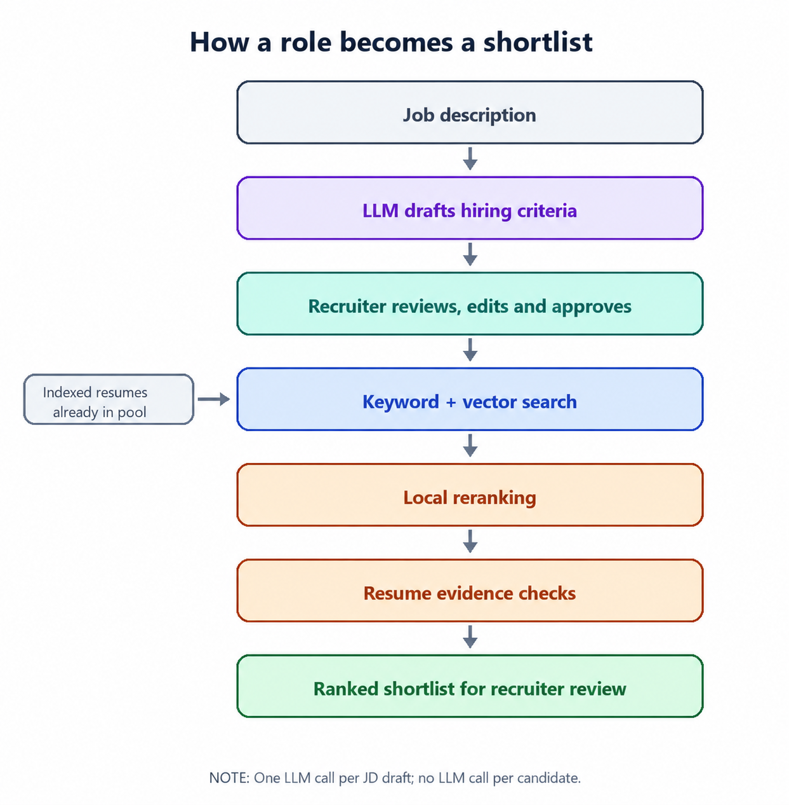

# Resume Screening and Candidate Ranking

## From a job description to an explainable shortlist

A useful shortlist starts before we search a single resume.

When a recruiter opens a role, the job description may be clear to a person but still leave important questions unanswered: Which skills are genuinely essential? Which are only preferred? How much experience is expected? Does location matter? What about availability or compensation?

If we search before agreeing on those priorities, we risk ranking candidates against an unclear interpretation of the role. The first step in the workflow is therefore **job calibration**.

The system makes one LLM call for the job-description draft and turns the freeform text into proposed hiring criteria. The model is not making a hiring decision. It is preparing a structured starting point for the recruiter.

The recruiter can then review the proposal, correct anything that was misunderstood, fill in anything the job description did not say, and approve the criteria. Ranking cannot begin until that approval is recorded.

## The workflow

*The recruiter approves the criteria before search begins. Indexed resumes are already available to the search step.*

This is the key design boundary: **the LLM is used once at the beginning to understand the role, not once for every candidate**.

Once the criteria are approved, the established ranking pipeline continues:

1. Keyword search finds resumes containing relevant terms.
2. Vector search finds candidates whose experience is meaningfully related, even when they use different wording.
3. A local reranker compares the strongest retrieved candidates more closely with the approved role.
4. Evidence checks look across the indexed resume, including Experience and Projects, rather than relying only on a Skills section.
5. The recruiter receives a ranked shortlist with supporting resume evidence to review.

This keeps model usage controlled: the LLM cost grows with the number of job drafts, not with the number of resumes in the candidate pool.

## What changed

Previously, the system drafted hiring priorities using rules and text patterns. That approach was predictable, but it depended heavily on how the job description was written. A clearly labelled JD could work well, while a natural or loosely structured JD could produce an incomplete draft.

The new calibration step uses an LLM to understand freeform job descriptions and propose the same structured priorities. The output is validated before it becomes a draft, and the recruiter remains responsible for approving it.

In the current implementation, `ingest_pdf` extracts text from digital PDFs with `pypdf`, normalizes the text, redacts supported PII, and stores the sanitized resume text. `chunk_resume` detects common resume sections such as Summary, Experience, Skills, Projects and Education, breaks entry-style sections into evidence units, then creates token-aware child chunks of up to 300 tokens with 40-token overlap while preserving each chunk's full parent evidence passage. `BAAI/bge-small-en-v1.5` embeds each section-aware chunk as a normalized 384-dimensional vector, and PostgreSQL stores both the chunk text and vector in `resume_chunks`. During ranking, the approved job profile is converted into one calibrated search query plus separate must-have requirement queries. Vector retrieval embeds each query with the BGE search prefix and uses pgvector cosine distance over the HNSW index to find semantically similar resume chunks. Keyword retrieval uses PostgreSQL full-text search with `plainto_tsquery('english', query)` against the generated `content_tsv` column. The dense and keyword candidate lists are combined with reciprocal-rank fusion, and only that retrieved pool continues into local cross-encoder reranking and resume-evidence checks.

| Stage | Previously | With LLM calibration |
| --- | --- | --- |
| Understand the role | Rules extracted criteria when the JD followed recognizable wording | One LLM call proposes criteria from the freeform JD |
| Agree on priorities | Recruiter edited and approved the draft | Recruiter still checks, corrects and approves the draft |
| Find candidates | Keyword and vector search retrieved a candidate pool | The same search uses the approved criteria |
| Build the shortlist | Local reranking and resume evidence checks assessed retrieved candidates | These stages continue without a per candidate LLM call |

## Where the recruiter is involved

There are two human touchpoints, and they serve different purposes.

**Before ranking: approval**  
The recruiter confirms that the hiring criteria reflect the role. This is a required control: an unapproved draft cannot be used to rank candidates.

**After ranking: professional review**  
The recruiter reviews the shortlist and its supporting evidence. This is not a second system approval gate; it is the recruiter's normal evaluation of the results and a source of feedback for improving ranking quality.

No workflow framework such as LangGraph is required for this stage today. The process is a clear, persisted state change from draft to approved. A workflow engine may become useful later if a recruitment agent must pause, wait for people or external systems, and resume a longer multi-step process.

## How to read the ranked results

The list is a decision-support tool, not an automated hiring verdict.

A high rank means the candidate matched the approved role more strongly within the candidates retrieved and reranked. It does not mean the person is automatically qualified or should be hired. Likewise, "not evidenced" means the available resume did not establish a requirement; it does not prove the candidate lacks it.

There is another important limitation: the deeper reranking step operates on the candidate pool found by search, not automatically on every indexed resume. That is why retrieval quality matters. If a promising candidate never enters the search pool, later scoring cannot recover them.

## What exists today

- Resumes can be ingested and indexed before a role is ranked.
- A job description can be converted into a structured hiring-criteria draft.
- The recruiter can edit and approve that draft before ranking.
- Approved criteria drive keyword and vector retrieval, reranking and evidence checks.
- Ranked candidates are shown in the context of a specific job.
- Candidate evidence can be inspected for a saved ranking result.

The current UI does not yet provide a paginated inventory of every indexed candidate independent of a job. That is a separate product decision. If added, it should let recruiters browse and search the overall candidate pool, while keeping every score and rank tied to the particular job that produced it. There is no meaningful global candidate rank across unrelated roles.

## What this workflow does not do yet

This is not yet a complete recruitment agent. It does not autonomously send outreach, run candidate questionnaires, schedule interviews or make hiring decisions. Those workflows can be added later, but they should build on a trustworthy ranking foundation.

## The next checkpoint

The implementation and automated checks are in place. The next step is end-to-end validation with real job descriptions and the live calibration endpoint, followed by recruiter review of the criteria and ranked evidence.

The questions we want to answer are practical:

- Did the calibration draft capture the role as the recruiter intended?
- Did search bring the right candidates into the ranking pool?
- Are the strongest candidates near the top?
- Does the resume evidence genuinely explain why each candidate was ranked?

Those answers should guide any changes to search limits, scoring weights or model choice. The objective is not to add AI everywhere; it is to make the shortlist more accurate, explainable and useful to the recruiter.
